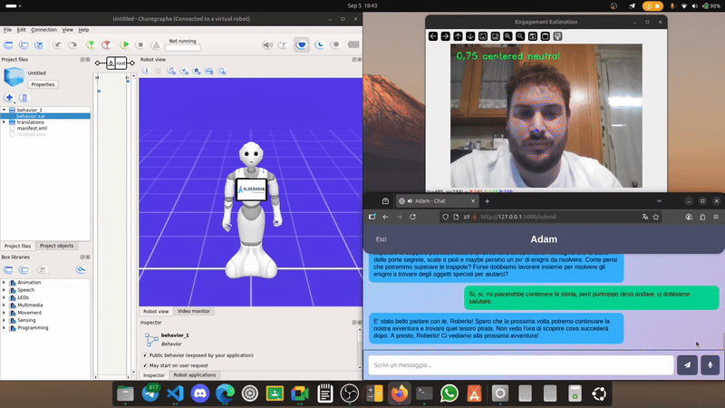

# 🤖Adam: a Robot therapist for autistic children
Adam is a Pepper robot therapist developed to assist in therapy session with autistic childer: in particular Adam is able to engage the child in conversation such as storytelling activities, and remember the child past sessions and information. Adam is able also to track the engagement of the child using both emotion and gaze, to recover the conversation if it is not liked by the child.
We have developed this project for the Human Robot Interaction and Robot Benchmarking and Competition course at Sapienza University of Rome.

## 🛠️ Requirements

The following tools and frameworks were used in this project:

- 🐳 **[Docker](https://www.docker.com/)** – containerization for deployment
- G **[Groq](https://groq.com/)** – server for fast AI inference (to use LLMs)
- 🐧 **[Ubuntu](https://ubuntu.com/)** – development environment  
- 🤖 **[Choregraphe (SoftBank Robotics)](https://aldebaran.com/en/support/kb/nao6/downloads/nao6-software-downloads/)** – robot programming environment 
- 📡 **[NAOqi SDK](http://doc.aldebaran.com/2-5/index_dev_guide.html)** – communication with Pepper  
- 💻 **[Python](https://www.python.org/)** – backend and logic  
- 🎨 **HTML / CSS** – user interface  
- 🐍 **[Conda](https://docs.conda.io/en/latest/)** – package and environment management  

To read all the details of the project, you can read the "**report.pdf**" file. 

To install and use the project, refer to our repository 📚 [Wiki](https://github.com/cybernetic-m/LLM-autistic-therapist/wiki).

## 👥 Authors

- 👨‍💻 **Massimo Romano** (ID: 2043836)  
  - 😺 GitHub: [cybernetic-m](https://github.com/cybernetic-m)  
  - 📧 Email: romano.2043836@studenti.uniroma1.it  

- 👨‍💻 **Paolo Renzi** (ID: 1887793)  
  - 😺 GitHub: [RenziPaolo](https://github.com/RenziPaolo)  
  - 📧 Email: renzi.1887793@studenti.uniroma1.it  

- 👨‍💻 **Antonio Lissa Lattanzio** (ID: 2154208)  
  - 😺 GitHub: [AntonLissa](https://github.com/AntonLissa)  
  - 📧 Email: lissalattanzio.2154208@studenti.uniroma1.it  
